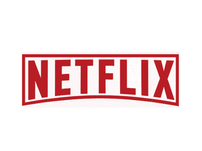

# NetFlixClone

- Netflix Landing Page Clone with HTML, CSS & JS

## Getting Started

To get started with this project, follow these steps:

    Clone the repository:

    git clone https://github.com/Aaditya110711/NetFlixClone.git

    Open the project in your preferred code editor.

    Launch the index.html file in a web browser to view the Netflix home page.

    Feel free to modify the code and customize the page according to your preferences. You can update the content, change the colors, or add new features.

## Author

👤 **Aaditya Rola**

- Github: [@Aaditya110711](https://github.com/Aaditya110711/)
- LinkedIn: [@Aaditya](https://in.linkedin.com/in/aaditya-rola-a21929227)